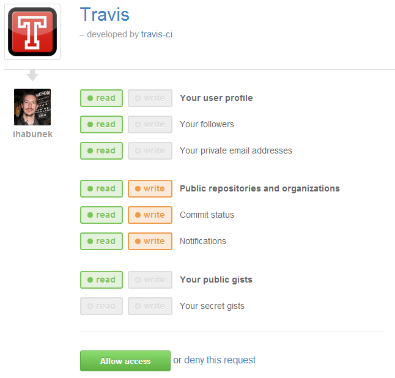
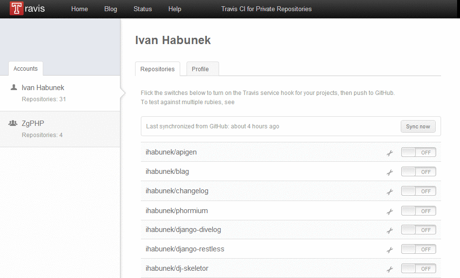
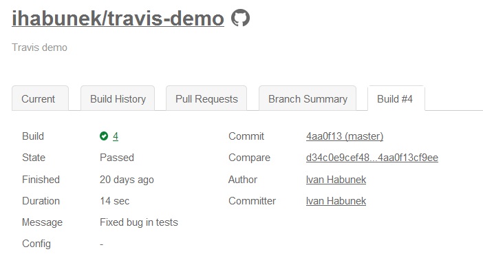
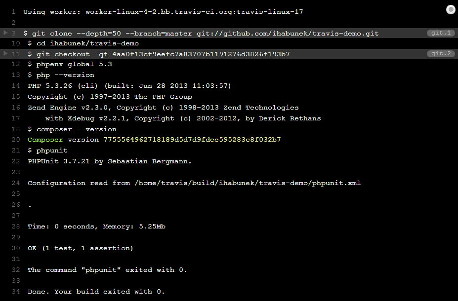
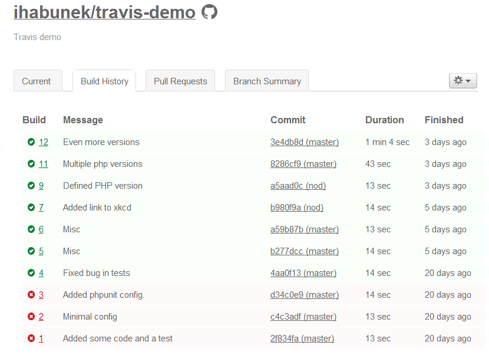

## Aktivacija

1. Login via GitHub
2. Service hook
3. .travis.yml
4. Push


## Login via GitHub




## Service hook

https://travis-ci.org/profile




## .travis.yml

#### Minimalna konfiguracija

```yml
language: php
```

Note:

- default verzija PHP 5.3.x


## Push!

```
> git push
```

```
Counting objects: 10, done.
Delta compression using up to 2 threads.
Compressing objects: 100% (7/7), done.
Writing objects: 100% (7/7), 777 bytes, done.
Total 7 (delta 3), reused 0 (delta 0)
To https://github.com/ihabunek/travis-demo.git
   8bf4a4d..2cb23eb  master -> master
```


## Build

https://travis-ci.org/ihabunek/travis-demo




## Build




## Build history


