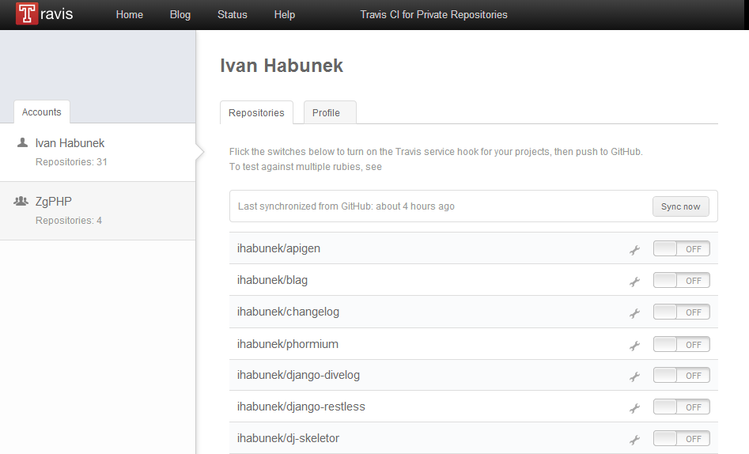
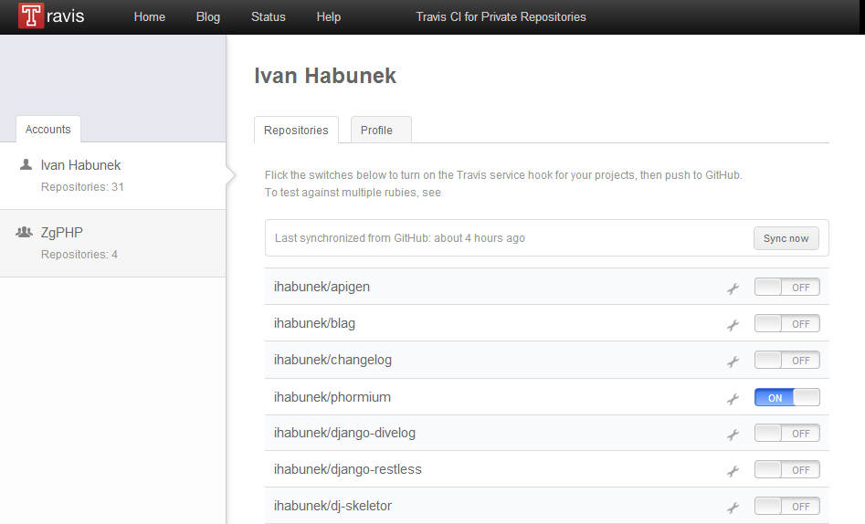

## Aktivacija

1. Login via GitHub
2. Service hook
3. .travis.yml
4. Push


## Service hook

`https://travis-ci.org/profile`




## Service hook

`https://travis-ci.org/profile`




## .travis.yml

#### Minimalna konfiguracija

```yml
language: php
```

Note:

- default verzija PHP 5.3.x


## Build

https://travis-ci.org/ihabunek/travis-demo


## Build


## Build history


