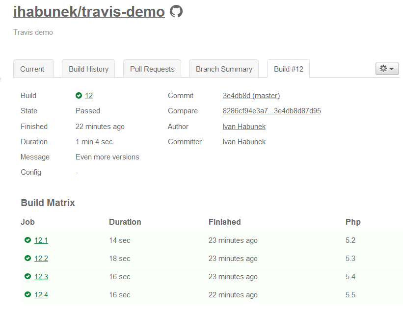
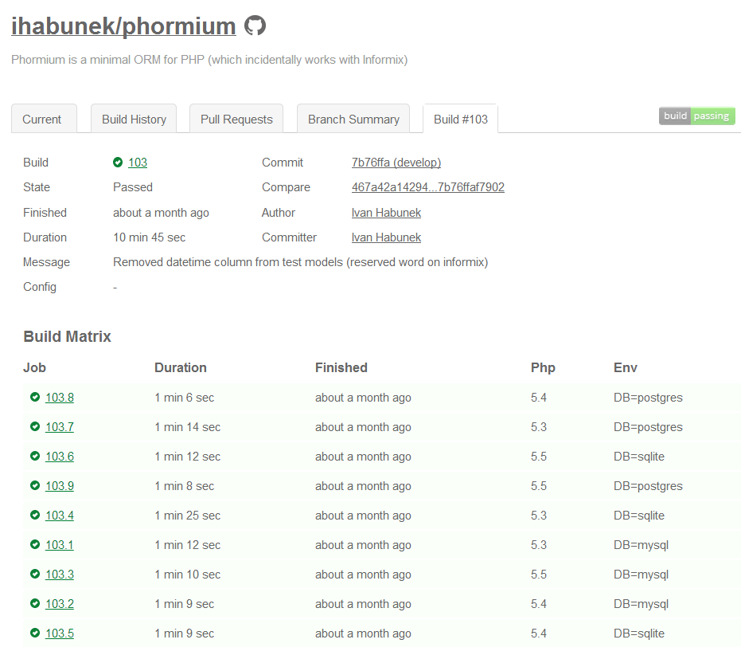
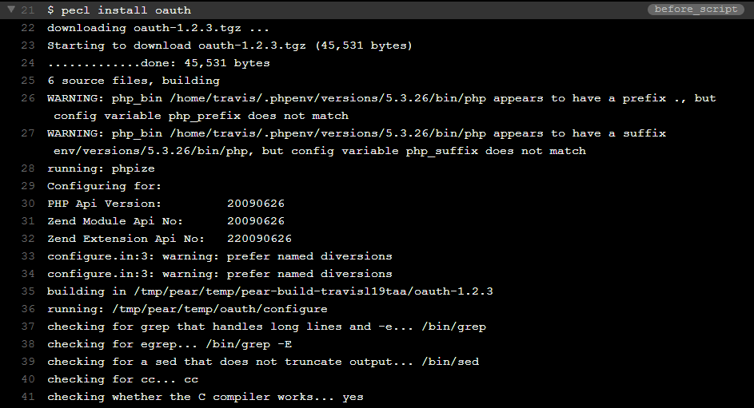
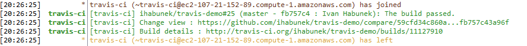

## .travis.yml

#### Odabir verzije

```yml
language: php

php: 5.4
```

Note:

- testovi se izvršavaju na zadnjoj dostupnoj pod-verziji u 5.4 branchu


## .travis.yml

#### Više verzija

```yml
language: php

php:
    - 5.2
    - 5.3
    - 5.4
    - 5.5
```

Note:
- ovo je super ako na razvojnoj mašini koristite PHP 5.5, za slučaj da
  iskoristite neku od novih funkcionalnosti koje ne postoje u starijim





## .travis.yml

#### script (default)

```yml
language: php

php:
    - 5.3
    - 5.4
    - 5.5

script: phpunit
```

Note:
- script: koju će komandu pozvati za izvršavanje testova


## .travis.yml

#### script

```yml
language: php

php:
    - 5.3
    - 5.4
    - 5.5

script: phpunit --configuration etc/phpunit.xml
```


## .travis.yml

#### script

```yml
language: php

php:
    - 5.3
    - 5.4
    - 5.5

script: ./bin/build.sh
```


## Testiranje u više okolina

```
D:\Projects\travis-demo
+-- phpunit.xml
+-- README.md
|
+---etc
|   +-- postgres.phpunit.xml
|   +-- mysql.phpunit.xml
|   \-- sqlite.phpunit.xml
|
+---src
|   \-- Random.php
|
\---tests
    \-- RandomTest.php
```


## Build matrix

```yml
language: php

env:
    - DB=postgres
    - DB=mysql
    - DB=sqlite

php:
    - 5.3
    - 5.4
    - 5.5

script: phpunit --configuration etc/$DB.phpunit.xml
```

Note:
- env je niz mogućih okolina, svaka može imati jednu ili više varijabli
- izvršit će testove za svaku moguću kombinaciju env i php





## Scripts

```
before script: echo "Zdravo svijete"

after_script:
    - echo "Tako mi mlijeka u prahu"
    - echo "Gibam nalijevo"

after_success: echo "Oh yess!"

after_faulure: echo "Oh noes!"
```

Note:
    - svaki hook sadrži jednu ili više shell naredbi
    - ovo nisu sve, nema vremena, vidi doksu


## Dependancy management

#### composer.json

```javascript
{
    "require": {
        "symfony/console": "2.3.*"
    }
}
```

#### .travis.yml

```yml
language: php

php:
    - 5.3
    - 5.4
    - 5.5

before_script:
    - composer install
```


## PECL

#### .travis.yml

```yml
before_script:
    - pecl install oauth
```




## Ručna instalacija

#### .travis.yml

```yml
language: php

php:
    - 5.3
    - 5.4
    - 5.5

before_script:
    - wget http://google-api-php-client.googlecode.com/
        files/google-api-php-client-0.6.6.tar.gz
    - mkdir vendor
    - tar xzvf google-api-php-client-0.6.6.tar.gz -C vendor
```

Note:
- može se verzija zamijeniti sa environment varijablom


## .travis.yml

#### notifications

```yml
notifications:
    email:
        - ivan.habunek@gmail.com
        - ivan@bezdomni.net
```


## .travis.yml

#### notifications

```yml
notifications:
    irc:
        - "irc.freenode.org#zgphp"
```




## .travis.yml

#### notifications

```yml
notifications:
    webhooks:
        urls:
            - http://bezdomni.net/hooks/travis
```

```json
{
    "id": 11127910,
    "repository": {
        "id": 1220417,
        "name": "travis-demo",
        "owner_name": "ihabunek",
        "url": "https:\/\/github.com\/ihabunek\/travis-demo"
    },
    "number": "25",
    "config": {
        "language": "php",
        "php": [
            5.3,
            5.4,
            5.5
        ],
        "before_script": [
            "composer self-update",
            "composer install"
        ],
        "notifications": {
            "webhooks": {
                "urls": [
                    "http:\/\/bezdomni.net\/travis.php"
                ],
                "on_success": "always",
                "on_failure": "always",
                "on_start": true
            },
            "irc": [
                "chat.freenode.net#zgphp"
            ]
        },
        ".result": "configured"
    },
    "status": 1,
    "result": 1,
    "status_message": "Pending",
    "result_message": "Pending",
    "started_at": "2013-09-08T18:25:28Z",
    "finished_at": null,
    "duration": null,
    "build_url": "https:\/\/travis-ci.org\/ihabunek\/travis-demo\/builds\/11127910",
    "commit": "fb757c43a96f6cf8886d612943da57a9c06a616c",
    "branch": "master",
    "message": "Testing IRC notifications",
    "compare_url": "https:\/\/github.com\/ihabunek\/travis-demo\/compare\/59cfd34c860a...fb757c43a96f",
    "committed_at": "2013-09-08T18:24:57Z",
    "author_name": "Ivan Habunek",
    "author_email": "ivan.habunek@gmail.com",
    "committer_name": "Ivan Habunek",
    "committer_email": "ivan.habunek@gmail.com"
}
```
