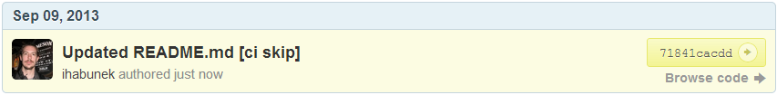
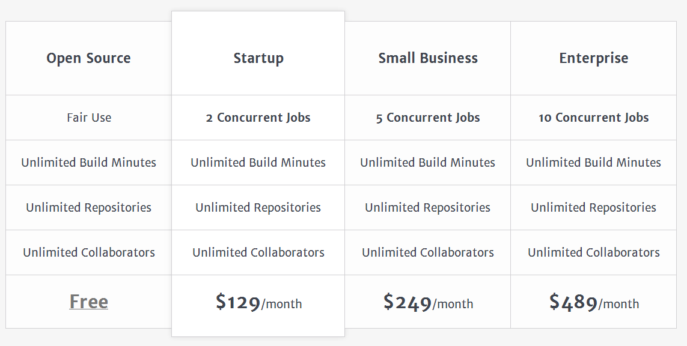

## Continuous deployment

- automatski deploy ako prođu testovi
- podržava: Heroku Nodejitsu OpenShift RubyGems


## Preskakanje testova




## Statusna slika

```bash
https://travis-ci.org/<username>/<project>.png
```

```
https://travis-ci.org/ihabunek/travis-demo.png
```

Prikazuje jedno od:

 


## Komercijalno korištenje

http://travis-ci.com/




## Pitanja?


## Links

- http://travis-ci.org/
- http://getcomposer.org/
- https://github.com/phpenv/phpenv

---

- https://github.com/hakimel/reveal.js/
- https://github.com/ihabunek/slides
