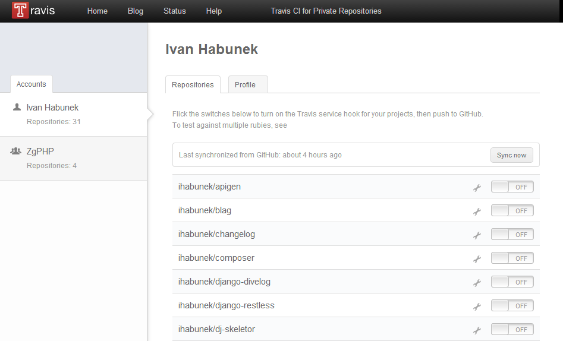
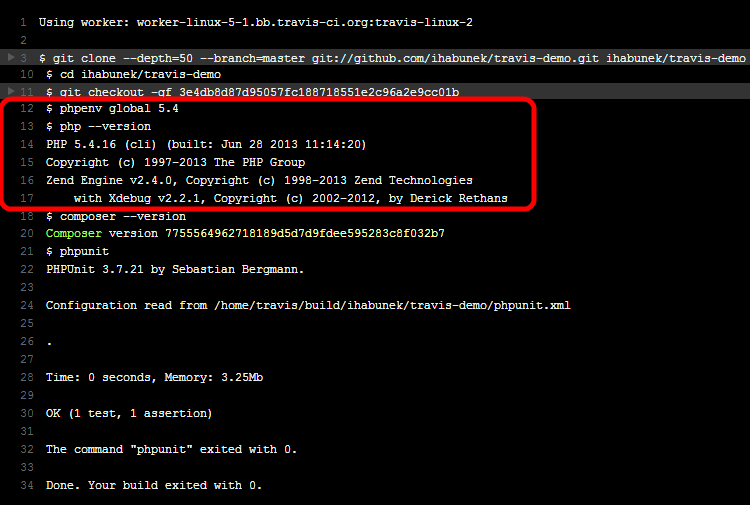

### Testiranje open source projekata

Ivan Habunek

@ihabunek


## O meni

- preko 10 godina iskustva u struci
- voditelj tima razvonih programera u Zagrebačkoj burzi


## Organizacija projekta

```
C:\Projects\git\travis-demo
+-- phpunit.xml
+-- README.md
|
+---src
|   \-- Random.php
|
\---tests
    \-- RandomTest.php
```

<small>omg windowz wtf n00b</small>


## Write Code

```
/src/Random.php
```

```
class Random
{
    public function getRandomNumber()
    {
        // Choosen by a fair dice roll.
        // Guaranteed to be random.
        return 4;
    }
}
```


## Write tests

```
/tests/RandomTest.php
```

```
require __DIR__ . '/../src/Random.php';

class RandomTest extends PHPUnit_Framework_TestCase
{
    public function testGetRandomNumber()
    {
        $random = new Random();
        $actual = $random->getRandomNumber();
        $this->assertSame(4, $actual);
    }
}
```


## Configure PHPUnit

```
/phpunit.xml
```

```
<phpunit>
    <testsuite>
        <directory>tests</directory>
    </testsuite>
</phpunit>
```


## Run phpunit

```
D:\Projects\git\travis-demo>phpunit
```

```
PHPUnit 3.7.21 by Sebastian Bergmann.

Configuration read from D:\Projects\git\travis-demo\phpunit.xml

.

Time: 0 seconds, Memory: 2.75Mb

OK (1 test, 1 assertion)
```


## Problemi

koji problemi?


## Kontinuirana integracija

- česta integracija
-
- integracija = merge na zajednički branch (npr. master ili develop)
- svaku integraciju provjerava automatizirano testiranje (e.g. phpunit) kako bi
  se greške otkrile što prije
- rano otkrivanje i eliminacija grešaka


- hosted CI
- besplatan za sve javne projekte na GitHubu
- podrška za razne jezike (C, C++, Clojure, Erlang, Go, Groovy, Haskell, Java, JavaScript, Objective-C, Perl, **PHP**, Python, Ruby, Scala)


- automatsko testiranje
    - svakog pusha
    - svakog pull requesta
- u čistoj okolini


## Aktivacija

1. Login via GitHub
2. Service hook
3. .travis.yml
4. Push


## Service hook

`https://travis-ci.org/profile`




## .travis.yml

#### Minimalna konfiguracija

```yml
language: php
```


## .travis.yml

#### Određivanje verzije

```yml
language: php
php: 5.4
```

Note:

- testovi se izvršavaju na zadnjoj dostupnoj pod-verziji u 5.4 branchu


## .travis.yml

#### Testiranje na više verzija

```yml
language: php
php:
    - 5.2
    - 5.3
    - 5.4
    - 5.5
```


## phpenv

[https://github.com/phpenv/phpenv](https://github.com/phpenv/phpenv)



Note:

- po uzoru na rbenv
- više PHP verzija paralelno na istoj mašini
- instalira PHP ravno iz repozitorija (build)


## Links

- http://travis-ci.org/
- http://getcomposer.org/
- https://github.com/phpenv/phpenv
